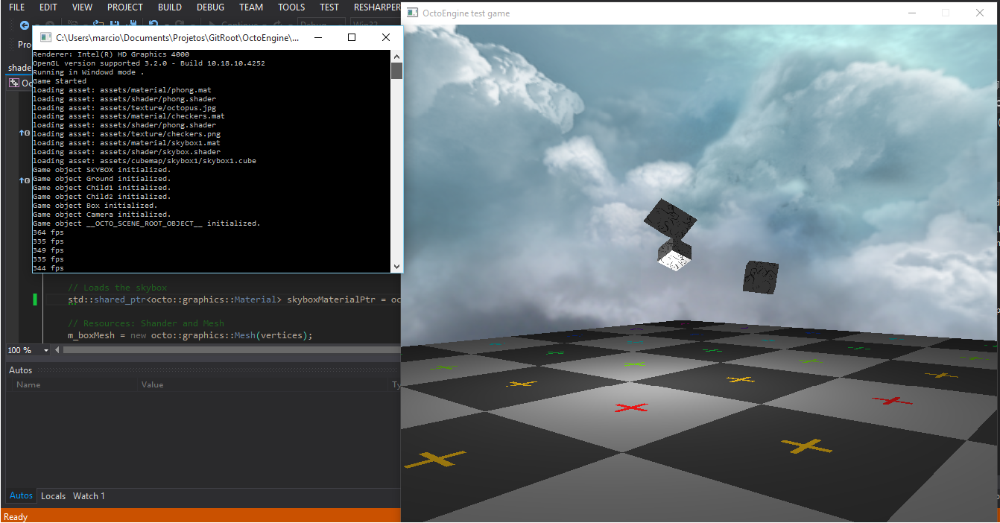

# OctoEngine
OctoEngine is a lightweight 3D game engine I've created for fun.
The goal was to learn a lot about CG and overall game engine architecture.
Although it is not being developed anymore, it still serves as a testbed for shaders and minor experiments.
The lessons learned here evolved to this [game engine project](https://github.com/marciovmf/ldare).

